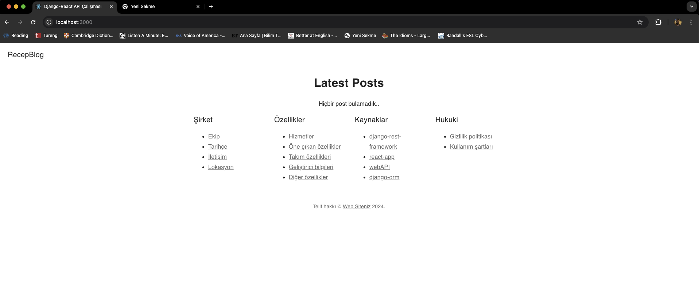
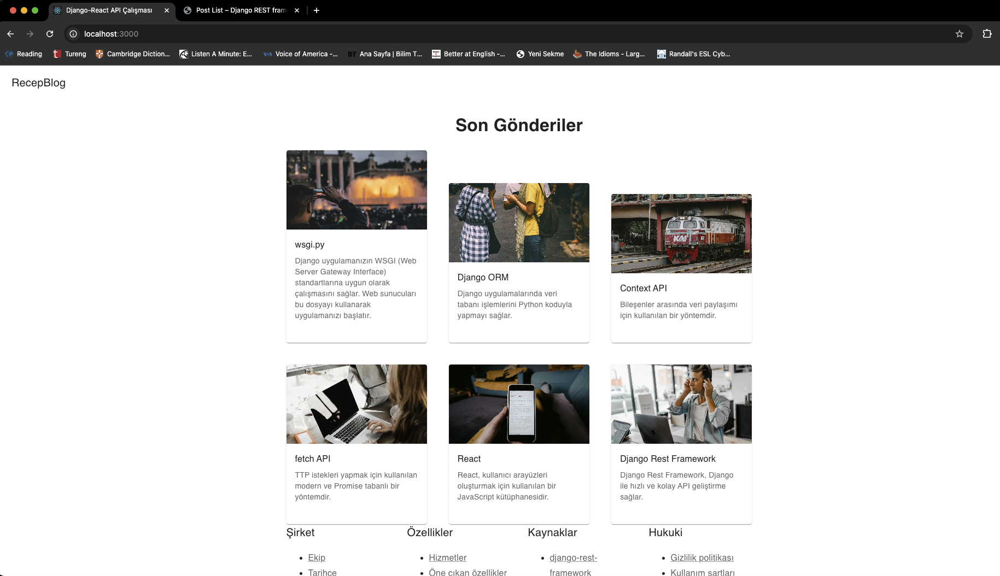
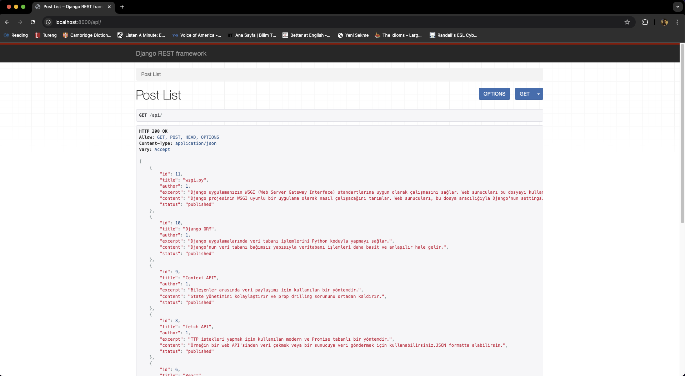

# Blog API Uygulaması

Bu proje, Django ve React kullanarak blog yazılarını API isteğiyle kolayca oluşturmanıza olanak tanır.

## Backend (Django)

### Post Model
Blog yazılarının başlık, yazar, özet, içerik ve durum bilgilerini içerir.

### API
- Yazıları listeleyebilir.
- Yeni yazılar ekleyebilir.
- Mevcut yazıları görüntüleyebilir.
- İçeriği silebilirsiniz.

## Frontend (React)

### Ana Sayfa
Son blog yazılarını gösterir.

### Bileşenler
- **Posts:** Blog yazılarını listeler.
- **PostLoading:** Veri yüklenmeden önce gösterilen yükleniyor yazar.
- **Header:** Üst kısımda başlık içerir.
- **Footer:** Alt kısımda bilgiler içerir.

## Kurulum ve Kullanım

1. **Projeyi Klonlayın:**
    ```bash
    git clone https://github.com/rkaya21/djangorestframework-react
    ```

2. **Backend Kurulumu:**

    - Proje dizinine gidin:
        ```bash
        cd djangorestframework-react/backend
        ```

    - Bağımlılıkları Yükleyin:
        ```bash
        pip install -r requirements.txt
        ```

    - Veritabanı Migrations:
        ```bash
        python manage.py migrate
        ```

    - Sunucuyu Başlatın:
        ```bash
        python manage.py runserver
        ```

    - API'ye [http://127.0.0.1:8000/api/](http://127.0.0.1:8000/api/) adresinden erişebilirsiniz.

3. **Frontend Kurulumu:**

    - Proje dizinine gidin:
        ```bash
        cd djangorestframework-react/frontend
        ```

    - Bağımlılıkları Yükleyin:
        ```bash
        npm install
        ```

    - Uygulamayı Başlatın:
        ```bash
        npm start
        ```

    - Web uygulamamız [http://localhost:3000](http://localhost:3000) adresinde çalışacaktır.

## Görseller




